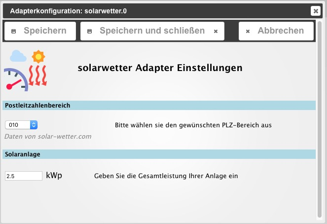

# ioBroker.solarwetter
=================

## Beschreibung / Description
:de: Dieser Adapter liefert den prognostizierten Solarstrom Tagesertrag für eine bestimmte Region. Die Daten kommen von [http://www.auswahl-plz-bereich.solar-wetter.com](http://solar-wetter.com).
Bei Eingabe der Leistung der eigenen Solaranlage errechnet der Adapter auch die zu erwartende Energieabgabe der Anlage.

:uk: This adapter delivers a forecast of the daily amount of solar power for a specific region from supplier [http://www.auswahl-plz-bereich.solar-wetter.com](http://solar-wetter.com). 
Translate!!!!

## Einstellungen / Configuration
### Region
Örtlichkeit durch Auswahl des Postleitzahlenbereichs bestimmen
Gesamtleistung der eigenen Solaranlage zur Berechnung der Energieerzeugung

Choose your region by selecting from the list of post codes.
Type in power of your solar plant to calculate energy output.

## Aktivierung / Schedule
Der Adapter startet einmal täglich.

The adapter starts once a day.

##  Datenpunkte / Datapoints

solarwetter.0.forecast.__clearSky__ (*value*)

solarwetter.0.forecast.__realSky_min__(*value*)

solarwetter.0.forecast.__realSky_max__ (*value*)

solarwetter.0.forecast.__Datum__  (*string, no timestamp*)

solarwetter.0.forecast.__Region__ (*value*)

solarwetter.0.forecast.home.__clearSky__ (*value*)

solarwetter.0.forecast.home.__realSky_min__(*value*)

solarwetter.0.forecast.home.__realSky_max__ (*value*)

solarwetter.0.forecast.home.__Leistung__ (*value*)

## Changelog
### 0.0.3 (2016-05-13)
* (pix) Calculates power of own solar plant

### 0.0.2 (2016-05-13)
* (pix) Post code area selectable

### 0.0.1 (2016-05-12)
* (pix) first release

## ToDo
* post code in settings load correct value
* beautify icon

## License

The MIT License (MIT)

Copyright (c) 2016 pix

Permission is hereby granted, free of charge, to any person obtaining a copy
of this software and associated documentation files (the "Software"), to deal
in the Software without restriction, including without limitation the rights
to use, copy, modify, merge, publish, distribute, sublicense, and/or sell
copies of the Software, and to permit persons to whom the Software is
furnished to do so, subject to the following conditions:

The above copyright notice and this permission notice shall be included in all
copies or substantial portions of the Software.

THE SOFTWARE IS PROVIDED "AS IS", WITHOUT WARRANTY OF ANY KIND, EXPRESS OR
IMPLIED, INCLUDING BUT NOT LIMITED TO THE WARRANTIES OF MERCHANTABILITY,
FITNESS FOR A PARTICULAR PURPOSE AND NONINFRINGEMENT. IN NO EVENT SHALL THE
AUTHORS OR COPYRIGHT HOLDERS BE LIABLE FOR ANY CLAIM, DAMAGES OR OTHER
LIABILITY, WHETHER IN AN ACTION OF CONTRACT, TORT OR OTHERWISE, ARISING FROM,
OUT OF OR IN CONNECTION WITH THE SOFTWARE OR THE USE OR OTHER DEALINGS IN THE
SOFTWARE.

---
*Logo is partly crafted by CHALLENGER* :+1: 
